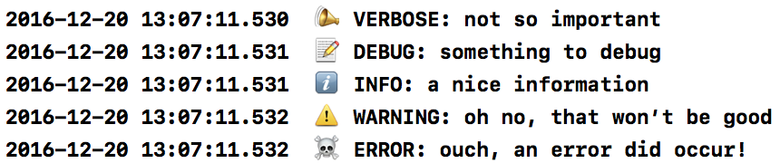
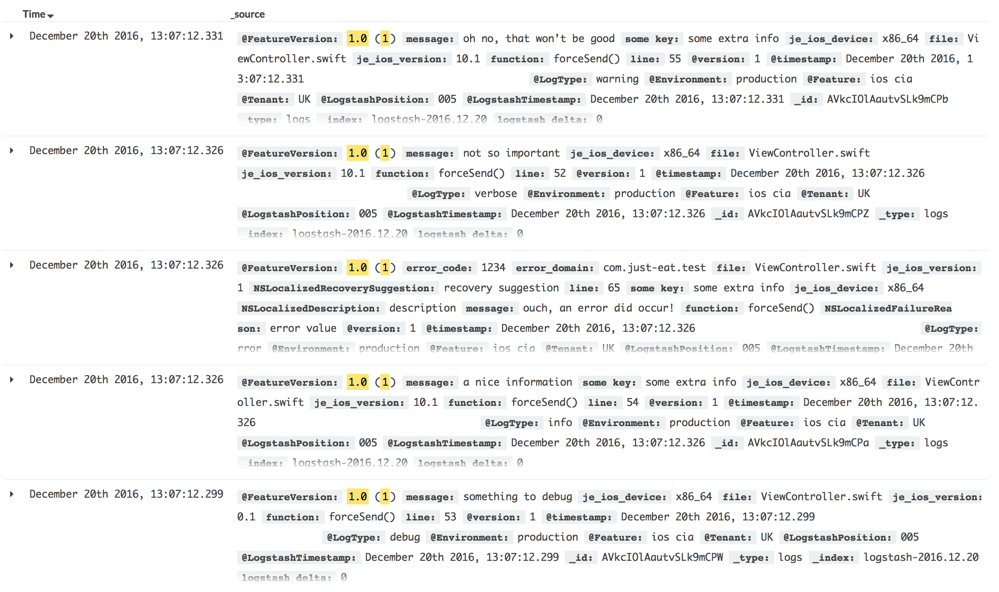
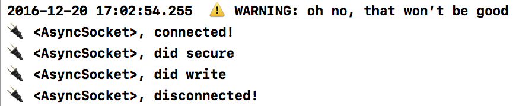

# JustLog

[](https://app.bitrise.io/app/f53e04b86e467ada)
[](http://cocoapods.org/pods/JustLog)
[](http://cocoapods.org/pods/JustLog)
[](http://cocoapods.org/pods/JustLog)

JustLog takes logging on iOS to the next level. It supports console, file and remote Logstash logging via TCP socket with no effort. Support for logz.io available.

# Overview

At Just Eat, logging and monitoring are fundamental parts of our job as engineers. Whether you are a back-end engineer or a front-end one, you'll often find yourself in the situation where understanding how your software behaves in production is important, if not critical. The ELK stack for real-time logging has gained great adoption over recent years, mainly in the back-end world where multiple microservices often interact with each other.

In the mobile world, the common approach to investigating issues is gathering logs from devices or trying to reproduce the issue by following a sequence of reported steps. Mobile developers are mostly familiar with tools such as [Google Analytics](https://analytics.google.com/analytics/web/) or [Fabric.io](https://fabric.io/) but they are _tracking_ systems, not fully fledged logging solutions.

We believe tracking is different in nature from logging and that mobile apps should take advantage of ELK too in order to take their monitoring and analysis to another level. Remote logging the right set of information could provide valuable information that would be difficult to gather otherwise, unveil unexpected behaviours and bugs, and even if the data was properly anonymized, identify the sequences of actions of singular users.

JustLog takes logging on iOS to the next level. It supports console, file and remote Logstash logging via TCP socket out of the box. You can also setup JustLog to use [logz.io](http://logz.io) with no effort. JustLog relies on [CocoaAsyncSocket](https://github.com/robbiehanson/CocoaAsyncSocket) and [SwiftyBeaver](https://github.com/SwiftyBeaver/SwiftyBeaver), exposes a simple swifty API but it also plays just fine with Objective-C.

JustLog sets the focus on remote logging, but fully covers the basic needs of local console and file logging.

# Usage

JustLog, is available through [CocoaPods](http://cocoapods.org). To install it, simply add the following line to your Podfile:

```ruby
pod "JustLog"
```

Import it into your files like so:

```swift
// swift
import JustLog

// Objective-C
@import JustLog;
```

This logging system strongly relies on [SwiftyBeaver](https://github.com/SwiftyBeaver/SwiftyBeaver).
We decided to adopt SwiftyBeaver due to the following reasons:

- good and extensible design
- ability to upload logs to the cloud
- macOS app to analyze logs

A log can be of one of 5 different types, to be used according to the specific need. A reasonable adopted convention on mobile could be the following:

- 📣 **verbose**: Use to trace the code, trying to find one part of a function specifically, sort of debugging with extensive information.
- 📝 **debug**: Information that is helpful to developers to diagnose an issue.
- ℹ️ **info**: Generally useful information to log (service start/stop, configuration assumptions, etc). Info to always have available but usually don't care about under normal circumstances. Out-of-the-box config level.
- ⚠️ **warning**: Anything that can potentially cause application oddities but an automatic recovery is possible (such as retrying an operation, missing data, etc.)
- ☠️ **error**: Any error which is fatal to the operation, but not the service or application (can't open a required file, missing data, etc.). These errors will force user intervention. These are usually reserved for failed API calls, missing services, etc.

When using JustLog, the only object to interact with is the shared instance of the `Logger` class, which supports 3 destinations:

- sync writing to Console (custom destination)
- sync writing to File (custom destination)
- async sending logs to [Logstash](https://www.elastic.co/products/logstash) (usually part of an [ELK](https://www.elastic.co/webinars/introduction-elk-stack) stack)

Following is a code sample to configure and setup the Logger. It should be done at app startup time, in the `applicationDidFinishLaunchingWithOptions` method in the AppDelegate.

```swift
let logger = Logger.shared

// file destination
logger.logFilename = "justeat-demo.log"

// logstash destination
logger.logstashHost = "my.logstash.endpoint.com"
logger.logstashPort = 3515
logger.logstashTimeout = 5
logger.logLogstashSocketActivity = true

// default info
logger.defaultUserInfo = ["app": "my iOS App",
                          "environment": "production",
                          "tenant": "UK",
                          "sessionID": someSessionID]
logger.setup()
```

The `defaultUserInfo` dictionary contains a set of basic information to add to every log.

The Logger class exposes 5 functions for the different types of logs. The only required parameter is the message, optional error and userInfo can be provided. Here are some examples of sending logs to JustLog:

```swift
Logger.shared.verbose("not so important")
Logger.shared.debug("something to debug")
Logger.shared.info("a nice information", userInfo: ["some key": "some extra info"])
Logger.shared.warning("oh no, that won’t be good", userInfo: ["some key": "some extra info"])
Logger.shared.error("ouch, an error did occur!", error: someError, userInfo: ["some key": "some extra info"])
```

It plays nicely with Objective-C too:

```objective-c
[Logger.shared debug_objc:@"some message"];
[Logger.shared info_objc:@"some message" userInfo:someUserInfo];
[Logger.shared error_objc:@"some message" error:someError];
[Logger.shared error_objc:@"some message" error:someError userInfo:someUserInfo];
```

*Please note that metadata such as filename and line number are unavailable in Objective-C.*

The message is the only required argument for each log type, while userInfo and error are optional.
The Logger unifies the information from `message`, `error`, `error.userInfo`, `userInfo`, `defaultUserInfo` and call-site info/metadata in a single dictionary with the following schema form of type [String : Any] (we call this 'aggregated form'). E.g. in JSON representation:

```json
{
  "message": "the log message",
  "user_info": {
    "app": "my iOS App",
    "environment": "production",
    "custom_key": "some custom value",
    ...
  },
  "errors": [
  {
    "error_domain" : "com.domain",
    "error_code" : "1234",
    "NSLocalizedDescription": ...,
    "NSLocalizedFailureReasonError": ...,
    ...
  },
  {
    "errorDomain" : "com.domain.inner",
    "errorCode" : "5678",
    "NSLocalizedDescription": ...,
    "NSLocalizedFailureReasonError": ...,
    ...
  }],  
  "metadata": {
    "file": ...,
    "function": ...,
    "line": ...,
    ...
  }
}

```

All destinations (console, file, logstash) are enabled by default but they can be disabled at configuration time like so:

```swift
logger.enableConsoleLogging = false
logger.enableFileLogging = false
logger.enableLogstashLogging = false
```

The above 5 logs are treated and showed differently on the each destination:


## Console

The console prints only the message.




## File

On file we store all the log info in the 'aggregated form'.

```json
2016-12-24 12:31:02.734  📣 VERBOSE: {"metadata":{"file":"ViewController.swift","app_version":"1.0 (1)","version":"10.1","function":"verbose()","device":"x86_64","line":"15"},"user_info":{"environment":"production","app":"my iOS App","log_type":"verbose","tenant":"UK"},"message":"not so important"}
2016-12-24 12:31:36.777  📝 DEBUG: {"metadata":{"file":"ViewController.swift","app_version":"1.0 (1)","version":"10.1","function":"debug()","device":"x86_64","line":"19"},"user_info":{"environment":"production","app":"my iOS App","log_type":"debug","tenant":"UK"},"message":"something to debug"}
2016-12-24 12:31:37.368  ℹ️ INFO: {"metadata":{"file":"ViewController.swift","app_version":"1.0 (1)","version":"10.1","function":"info()","device":"x86_64","line":"23"},"user_info":{"environment":"production","app":"my iOS App","log_type":"info","tenant":"UK","some key":"some extra info"},"message":"a nice information"}
2016-12-24 12:31:37.884  ⚠️ WARNING: {"metadata":{"file":"ViewController.swift","app_version":"1.0 (1)","version":"10.1","function":"warning()","device":"x86_64","line":"27"},"user_info":{"environment":"production","app":"my iOS App","log_type":"warning","tenant":"UK","some key":"some extra info"},"message":"oh no, that won’t be good"}
2016-12-24 12:31:38.475  ☠️ ERROR: {"metadata":{"file":"ViewController.swift","app_version":"1.0 (1)","version":"10.1","function":"error()","device":"x86_64","line":"47"},"user_info":{"environment":"production","log_type":"error","some key":"some extra info","app":"my iOS App","tenant":"UK","NSLocalizedFailureReason":"error value"},"errors":[{"error_code":1234,"error_domain":"com.just-eat.test","NSLocalizedDescription":"description","NSLocalizedRecoverySuggestion":"recovery suggestion"}],"message":"ouch, an error did occur!"}
```


## Logstash

Before sending a log to Logstash, the 'aggregated form' is flattened to a simpler `[String : Any] dictionary, easily understood by Logstash and handy to be displayed on Kibana. E.g. in JSON representation:

```json
{
  "message": "ouch, an error did occur!",

  "environment": "production",
  "log_type": "error",
  "version": "10.1",
  "app": "iOS UK app",
  "tenant": "UK",
  "app_version": "1.0 (1)",
  "device": "x86_64",

  "file": "ViewController.swift",
  "function": "error()",
  "line": "47",
  "errors": [{
    "error_domain": "com.just-eat.test",
    "error_code": "1234",
    "NSLocalizedDescription": "description",
    "NSLocalizedFailureReason": "error value"
  }]
}
```

Which would be shown in Kibana as follows:




## A note on Logstash destination

The logstash destination is configured via properties exposed by the Logger. E.g.:

```swift
let logger = Logger.shared
logger.logstashHost = "my.logstash.endpoint.com"
logger.logstashPort = 3515
logger.logstashTimeout = 5
logger.logLogstashSocketActivity = true
```

When the `logLogstashSocketActivity` is set to true, socket activity is printed to the console:



This destination is the only asynchronous destination that comes with JustLog. This means that logs to Logstash are batched and sent at some point in future when the timer fires. The `logstashTimeout` property can be set to the number of seconds for the dispatch.
In some cases, it might be important to dispatch the logs immediately after an event occurs like so:

```swift
Logger.shared.forceSend()
```

or, more generally, in the `applicationDidEnterBackground` and `applicationWillTerminate` methods in the AppDelegate like so:

```swift
func applicationDidEnterBackground(_ application: UIApplication) {
  forceSendLogs(application)
}

func applicationWillTerminate(_ application: UIApplication) {
  forceSendLogs(application)
}

private func forceSendLogs(_ application: UIApplication) {

  var identifier = UIBackgroundTaskIdentifier(rawValue: 0)

  identifier = application.beginBackgroundTask(expirationHandler: {
    application.endBackgroundTask(identifier)
    identifier = UIBackgroundTaskIdentifier.invalid
  })

  Logger.shared.forceSend { completionHandler in
    application.endBackgroundTask(identifier)
    identifier = UIBackgroundTaskIdentifier.invalid
  }
}
```


## Sending logs to logz.io

JustLog supports sending logs to [logz.io](http://logz.io).

At the time of writing, logz.io uses the following host and port (please refer to the official [documentation](https://app.logz.io/#/dashboard/data-sources/TLSSSL-TCP)):

```swift
logger.logstashHost = "listener.logz.io"
logger.logstashPort = 5052
```

When configuring the Logger (before calling `setup()`), simply set the token like so:

```swift
logger.logzioToken = <logzio_token>
```


# Conclusion

JustLog aims to be an easy-to-use working solution with minimal setup. It covers the most basic logging needs (console and file logging) via the great foundations given by SwiftBeaver, but also provides an advanced remote logging solution for Logstash (which is usually paired with Elasticsearch and Kibana in an [ELK](https://www.elastic.co/webinars/introduction-elk-stack) stack). JustLog integrates with [logz.io](http://logz.io), one of the most widely used ELK SaaS, placing itself as the only solution in the market (at the time of writing) to leverage such stack on iOS.

We hope this library will ease the process of setting up the logging for your team and help you find solutions to the issues you didn't know you had.


- Just Eat iOS team
